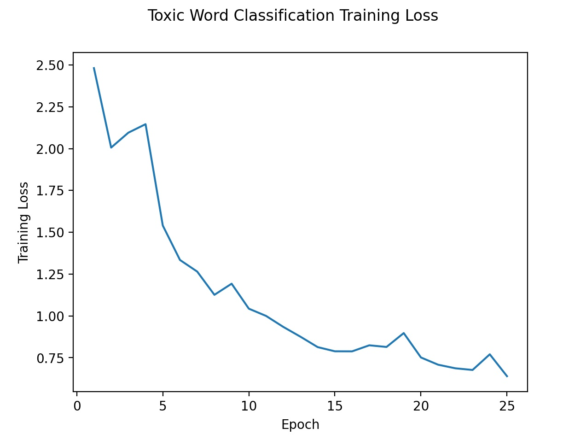

# Red Dragon AI Course Advanced NLP
This repository contains the assignment as a requirement to complete the Red Dragon AI Course on Advanced NLP. There are two components to this assignment - (i) the Toxic Word Challenge, and (ii) a NLP work of our own choice. For (ii), a chatbot is trained using the [Transformer](https://arxiv.org/abs/1706.03762) network using the [movie dialogue](http://www.cs.cornell.edu/~cristian/Cornell_Movie-Dialogs_Corpus.html) dataset. The processing of the dialogue dataset follows that of this [script](https://github.com/suriyadeepan/datasets/blob/master/seq2seq/cornell_movie_corpus/scripts/prepare_data.py) closely.

## 1. Toxic Word Challenge
The first assignement is based on the [toxic word challenge](https://www.kaggle.com/c/jigsaw-toxic-comment-classification-challenge). This dataset is heavily imbalanced and could contain multiple labels per comment. Since this is a binary classification problem, I applied a 1-Dimensional Convolution Layer across a window of 5 (`stride = 5`) for two times before passing the feature maps through 2 Fully-Connected layers to produce the logits. 

### 1.1 Data Processing
Simple processing of the data was done, including lower-casing the comments, separating punctuation and building the vocabulary to consist of words which have occurred at least 10 times. The maximum length of the comment was set to 70 tokens.
```
tmp_comment = tmp_comment.replace("\n", " \n ")
tmp_tokens  = [
    x for x in word_tokenizer(tmp_comment.lower()) if x != ""]
w_counter.update(tmp_tokens)
```
The vocab is then built by
```
vocab_list = sorted(
    [x for x, y in w_counter.items() if y >= min_count])
```
where `min_count = 5`. In addition to that, in the test dataset, there are `-1` labels. These labels were assigned to a value of `0`, since it was empiracally observed that these comments were relatively neutral. Some examples include
```
\n\n == Sources == \n\n * Zawe Ashton on Lapland —  /  
```
and
```
:If you have a look back at the source, the information I updated was the correct form. I can only guess the source hadn't updated. I shall update the information once again but thank you for your message.
```
Nonetheless, it is worth noting that there were toxic comments that should clearly be given a label such as
```
Yo bitch Ja Rule is more succesful then you'll ever be whats up with you and hating you sad mofuckas...i should bitch slap ur pethedic white faces and get you to kiss my ass you guys sicken me. Ja rule is about pride in da music man. dont diss that shit on him. and nothin is wrong bein like tupac he was a brother too...fuckin white boys get things right next time.,
```
which would serve to convey an inaccurate picture of the model's performance on the test dataset.

### 1.2 Neural Network Model
For the model, we introduced a bias `tf.math.log((1.0-tmp_pi)/tmp_pi)` to the logits to indicate the imbalance in the labels. This generally follows the advice given in the [Focal Loss](https://arxiv.org/abs/1708.02002) paper. The model as returned by `toxic_model.summary()` is as follows:
```
Model: "model"
_________________________________________________________________
Layer (type)                 Output Shape              Param #
=================================================================
x_input (InputLayer)         [(None, 251)]             0
_________________________________________________________________
embedding (Embedding)        (None, 251, 32)           672448
_________________________________________________________________
conv1d (Conv1D)              (None, 124, 64)           10304
_________________________________________________________________
tf_op_layer_Relu (TensorFlow [(None, 124, 64)]         0
_________________________________________________________________
conv1d_1 (Conv1D)            (None, 60, 128)           41088
_________________________________________________________________
tf_op_layer_Relu_1 (TensorFl [(None, 60, 128)]         0
_________________________________________________________________
flatten (Flatten)            (None, 7680)              0
_________________________________________________________________
linear1 (Dense)              (None, 128)               983168
_________________________________________________________________
linear2 (Dense)              (None, 32)                4128
_________________________________________________________________
logits (Dense)               (None, 6)                 198
_________________________________________________________________
tf_op_layer_add (TensorFlowO [(None, 6)]               0
=================================================================
Total params: 1,711,334
Trainable params: 1,711,334
Non-trainable params: 0
```
As can be observed, the model is relatively simple with about 1.7 million parameters. Where the comment exceeds the maximum length set, it is truncated. Otherwise, it is padded. The embedding dimension was set to 32 and a batch size of 256 was chosen for training.

### 1.2 Losses
To handle the skewed labels, we could apply either the Focal Loss, or to weigh the sigmoid loss to allow a higher loss to be assigned to positive labels. In this assignment, I applied a weight to the binary loss as it showed better results. The training loss using a weight of 25.0 for positive labels yields a precision of 0.0962 and a recall of 0.8473. The training progress over 25 epochs is shown in Fig. 1 below.

Fig. 1: Training Loss of Toxic Word Model

The tuning of the weights is provided in Table 1 below.

| Weight  | Precision | Recall |
| ------- | --------- | ------ |
|  1.0    | 0.1311    | 0.6797 |
| 10.0    | 0.1042    | 0.8132 |
| 25.0    | 0.0962    | 0.8473 |

Table 1: Precision and Recall Performance on test dataset using different weights for the positive labels

We can observe that increasing the weight of the positive labels generally leads to an increase in the recall but a decrease in the precision. This occurs because the True Positives increased, while False Negatives decreased and the False Positives increased. Another possible reason for the decrease in performance could be in the insufficient coverage between the test and training vocabularies, where approximately 20% of the tokens in the test vocabulary is not within the training vocabulary. 


