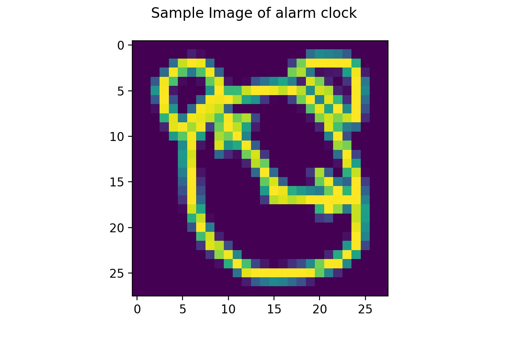

# Red Dragon AI Advanced Computer Vision Course
## Assignment 1

This repository contains the code and write-up for the first assignment of the Advanced Computer Vision course by Red Dragon AI. The assignment requires us to classify the category of a sketch as provided by the [QuickDraw](https://github.com/googlecreativelab/quickdraw-dataset) dataset. The code is written in Tensorflow 2.0.

### Data
The dataset we used is the set of images provided in `.npy` format. As the official site mentioned, the images are simplified into a 28x28 grayscale bitmap which are aligned to the center of the drawing's bounding box. Some examples are shown below. The dataset in this assignment has been filtered to contain only 20 classes out of the full 345 categories, with approximately 2.5 million drawings. Due to the limited hardware processing capabilities, only 12,500 images per category is used as the dataset for this assignment, leading to a total of 250,000 drawings. Some sample drawings are shown in Fig. 1 below.

Alarm Clock | Birthday Cake | Eyeglasses
:-------------------------:|:-------------------------:|:-------------------------:
 |  | 
Fig. 1: Sample Drawings from the filtered dataset.

### Deep Learning Model
The model that was applied is a relatively simple model consisting of a 2D Convolutional Layer with 32 filters and ReLU activation, followed by a 2D Max-Pool operation, followed by another 2D Convolutional Layer with 64 filters and ReLU activation, followed by a 2D Max-Pool operation. The feature maps are then flattened and sent through a Fully-Connected Layer with 64 units and ReLU activation and finally obtaining the logits by sending it through another Fully Connected Layer with 20 units. The code snippet where the model is built is provided below:
```
x_inputs  = tf.keras.Input(shape=(28,28,1,), name='img_input')
x_layer_1 = layers.Conv2D(
    32, (3, 3), activation='relu', name='cnn_1')(x_inputs)
x_pool_1  = layers.MaxPooling2D((2, 2))(x_layer_1)
x_layer_2 = layers.Conv2D(
    64, (3, 3), activation='relu', name='cnn_2')(x_pool_1)
x_pool_2  = layers.MaxPooling2D((2, 2))(x_layer_2)
x_flatten = layers.Flatten()(x_pool_2)
x_linear  = layers.Dense(
    64, activation="relu", name="linear")(x_flatten)
x_outputs = \
    layers.Dense(n_classes, name='logits')(x_linear)

quickdraw_model = tf.keras.Model(inputs=x_inputs, outputs=x_outputs)
```

The `quickdraw_model.summary()` output is as shown below:
```
_________________________________________________________________
Layer (type)                 Output Shape              Param #
=================================================================
img_input (InputLayer)       [(None, 28, 28, 1)]       0
_________________________________________________________________
cnn_1 (Conv2D)               (None, 26, 26, 32)        320
_________________________________________________________________
max_pooling2d (MaxPooling2D) (None, 13, 13, 32)        0
_________________________________________________________________
cnn_2 (Conv2D)               (None, 11, 11, 64)        18496
_________________________________________________________________
max_pooling2d_1 (MaxPooling2 (None, 5, 5, 64)          0
_________________________________________________________________
flatten (Flatten)            (None, 1600)              0
_________________________________________________________________
linear (Dense)               (None, 64)                102464
_________________________________________________________________
logits (Dense)               (None, 20)                1300
=================================================================
Total params: 122,580
Trainable params: 122,580
Non-trainable params: 0
_________________________________________________________________
```
As the model's summary shows, the model is relatively small with a total of 122,000 parameters. No weight regularization is applied.

### Training the Model
To update the weights, the Cross Entropy Loss Function was applied. The model was trained for a total of 50 epochs with a batch size of 256 per step and a constant learning rate of 0.01. This is done by compiling the Tensorflow model as follows:
```
quickdraw_model.compile(
    optimizer=tf.keras.optimizers.Adam(learning_rate=learning_rate), 
    loss=tf.keras.losses.SparseCategoricalCrossentropy(from_logits=True),
    metrics=["sparse_categorical_accuracy"])
```

The training progress is shown in Fig. 2 below, with a final validation accuracy of 82.8%.
Training Progress | Sample Prediction
:-------------------------:|:-------------------------:
 | 

Fig. 2: (Left) Training Progress of CNN Model and (Right) Prediction Output of Classifier


