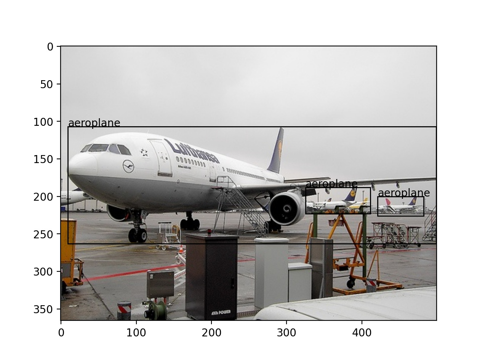
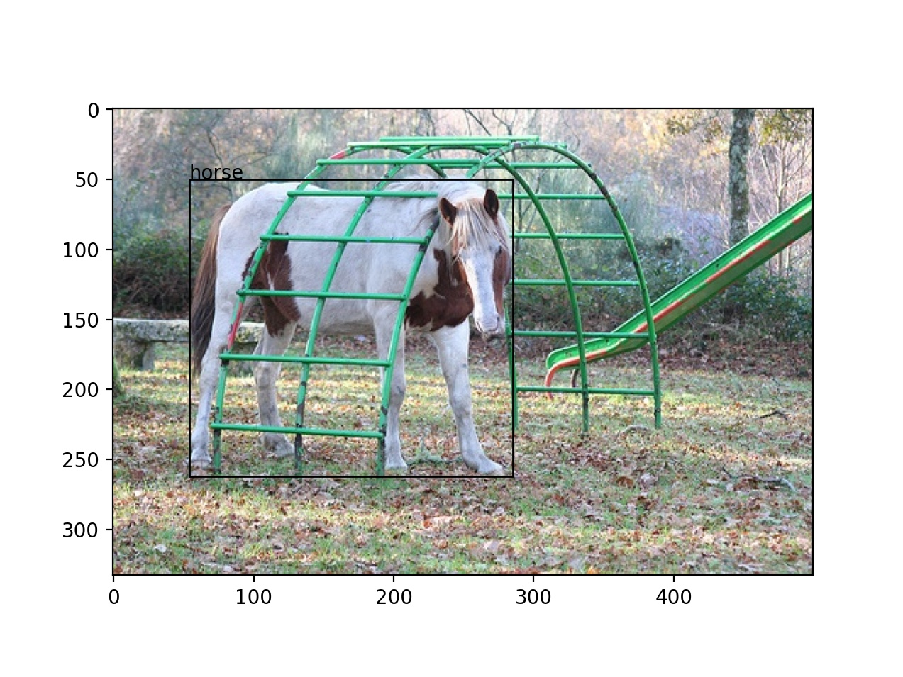
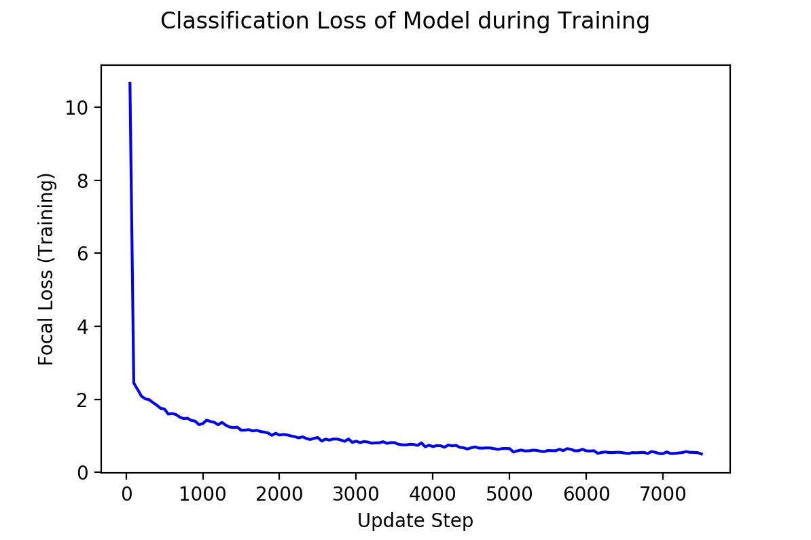
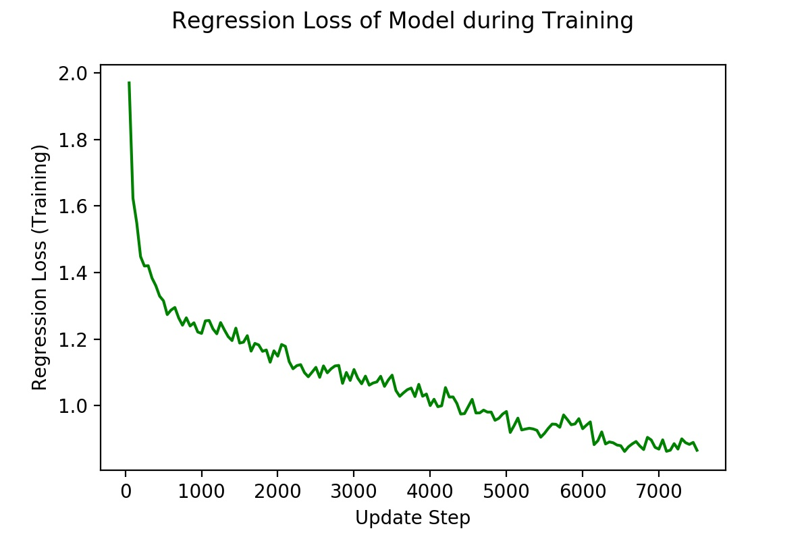

# Red Dragon AI Advanced Computer Vision Course
## Assignment 2

This repository contains the code and write-up for the second assignment of the Advanced Computer Vision course by Red Dragon AI. For this assignment, a simplified Object Detection model is fitted on the [PASCAL Visual Object Classes (VOC)](http://host.robots.ox.ac.uk/pascal/VOC/) dataset. 

### Dataset
The VOC dataset consists of approximately 17,000 images annotated with a total of 20 object classes including Persons, Cars, Bicycles etc. Some sample images are shown in Fig. 1 below.

Sample Image 1 | Sample Image 2
:-------------:|---------------:
 | 

Fig. 1: Sample Images from the VOC dataset.

### Object Detection Model
The Object Detection Model is a one-stage model which uses `MobileNetv2` as the backbone model, where the feature maps of the C3, C4, C5 and final layer of the backbone model is sent into through a 2D CNN layer without using advanced features like Feature Pyramid Networks (FPNs) to predict the regression offsets and the classification logits, resulting in a total of 4 anchor boxes. The weights of the output heads are not shared across the different scales. The `MobileNetv2` model is shipped as part of Tensorflow 2.0 and can be loaded directly using
```
mobilenet_v2 = tf.keras.applications.MobileNetV2(
    input_shape=(img_rows, img_cols, 3), 
    include_top=False, weights="imagenet", pooling=None)
```
and the corresponding layer of the model can be extracted via
```
x_blk5_out = \
    mobilenet_v2.get_layer("block_13_expand_relu").output
```
Finally, the model is constructed by collating the predictions of the different anchors into a list as the output.
```
x_output = [
    x_out_small, x_out_medium, 
    x_out_large, x_out_vlarge]
obj_model = tf.keras.Model(
    inputs=mobilenet_v2.input, outputs=x_output)
```
Fig. 2 shows the network architecture in greater detail.


Fig. 2: Object Detection Architecture Applied.

A model summary shows that the network has approximately 2.75 million parameters. The full breakdown of the number of parameters at each layer can be found in the file `voc_model_v5_summary.txt`.

### Training the Model
The training loss uses an L1 regression loss for the bounding box regression offsets and the Focal Loss for the classification loss. To evaluate the model's performance, the images are seperated into a training (80%) and validation (20%) dataset. Fig. 3 shows model's loss as the training progresses, while Fig. 4 shows the improvement of the model's ability to detect objects of interest as training progresses.

Classification Loss | Regression Loss
:------------------:|:---------------:
 | 

Fig. 3: Classification and Regression Losses as training progresses

Detection Output at Iteration 100 | Detection Output at Iteration 500
:------------------:|:---------------:
 | 
