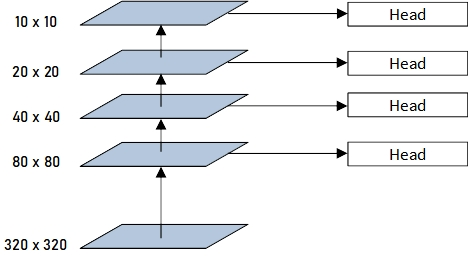

# Red Dragon AI Advanced Computer Vision Course
## Assignment 2

This repository contains the code and write-up for the second assignment of the Advanced Computer Vision course by Red Dragon AI. For this assignment, a simplified Object Detection model is fitted on the [PASCAL Visual Object Classes (VOC)](http://host.robots.ox.ac.uk/pascal/VOC/) dataset. 

## Dataset
The VOC dataset consists of approximately 17,000 images annotated with a total of 20 object classes including Persons, Cars, Bicycles etc. Some sample images are shown in Fig. 1 below.

Sample Image 1 | Sample Image 2
:-------------:|:-------------:
 | 

Fig. 1: Sample Images from the VOC dataset.

## Object Detection Model
The Object Detection Model is a one-stage model which uses `MobileNetv2` as the backbone model, where the feature maps of the backbone model at various scales is sent into through a 2D CNN layer without using advanced features like Feature Pyramid Networks (FPNs) to predict the regression offsets and the classification logits, resulting in a total of 4 scales. The weights of the output heads are not shared across the different scales. The `MobileNetv2` model is shipped as part of Tensorflow 2.0 and can be loaded directly using
```
mobilenet_v2 = tf.keras.applications.MobileNetV2(
    input_shape=(img_rows, img_cols, 3), 
    include_top=False, weights="imagenet", pooling=None)
```
and the corresponding layer of the model can be extracted via:
```
x_blk5_out = \
    mobilenet_v2.get_layer("block_13_expand_relu").output
```
The various feature maps are given by
```
# Extract the feature maps. #
x_blk3_out = \
    mobilenet_v2.get_layer("block_3_expand_relu").output
x_blk4_out = \
    mobilenet_v2.get_layer("block_6_expand_relu").output
x_blk5_out = \
    mobilenet_v2.get_layer("block_13_expand_relu").output
x_blk6_out = \
    mobilenet_v2.get_layer("out_relu").output
```
and these are sent through separate 2D CNNs as follows:
```
 # Regression and Classification heads. #
x_reg_small = tf.nn.sigmoid(layers.Conv2D(
    4, (3, 3), strides=(2, 2), padding="same", 
    activation="linear", name="reg_small")(x_blk3_out))
x_cls_small = layers.Conv2D(
    n_classes, (3, 3), strides=(2, 2), padding="same", 
    activation="linear", name="cls_small")(x_blk3_out)
x_out_small = tf.concat(
    [x_reg_small, b_focal(x_cls_small)], axis=3)

x_reg_medium = tf.nn.sigmoid(layers.Conv2D(
    4, (3, 3), strides=(2, 2), padding="same", 
    activation="linear", name="reg_medium")(x_blk4_out))
x_cls_medium = layers.Conv2D(
    n_classes, (3, 3), strides=(2, 2), padding="same", 
    activation="linear", name="cls_medium")(x_blk4_out)
x_out_medium = tf.concat(
    [x_reg_medium, b_focal(x_cls_medium)], axis=3)

x_reg_large = tf.nn.sigmoid(layers.Conv2D(
    4, (3, 3), strides=(2, 2), padding="same", 
    activation="linear", name="reg_large")(x_blk5_out))
x_cls_large = layers.Conv2D(
    n_classes, (3, 3), strides=(2, 2), padding="same", 
    activation="linear", name="cls_large")(x_blk5_out)
x_out_large = tf.concat(
    [x_reg_large, b_focal(x_cls_large)], axis=3)

x_reg_vlarge = tf.nn.sigmoid(layers.Conv2D(
    4, (3, 3), strides=(2, 2), padding="same", 
    activation="linear", name="reg_vlarge")(x_blk6_out))
x_cls_vlarge = layers.Conv2D(
    n_classes, (3, 3), strides=(2, 2), padding="same", 
    activation="linear", name="cls_vlarge")(x_blk6_out)
x_out_vlarge = tf.concat(
    [x_reg_vlarge, b_focal(x_cls_vlarge)], axis=3)
```
These are then appended to obtain the output:
```
x_output = [
    x_out_small, x_out_medium, 
    x_out_large, x_out_vlarge]
obj_model = tf.keras.Model(
    inputs=mobilenet_v2.input, outputs=x_output)
```
Fig. 2 shows the network architecture in greater detail.



Fig. 2: Object Detection Architecture Applied.

A model summary shows that the network has approximately 2.75 million parameters. The full breakdown of the number of parameters at each layer can be found in the file `voc_model_v5_summary.txt`.

## Formatting the Data
The data is formatted in a similar manner to that using [FCOS](https://arxiv.org/abs/1904.01355). The scales of the different anchor boxes are first specified such that
```
img_scale  = [40, 80, 160, 320]
```
and an object is only assigned to one centroid in the image in one anchor
```
if tmp_width < 0 or tmp_height < 0:
    continue
elif tmp_width < img_scale[0] and tmp_height < img_scale[0]:
    id_sc = 0
    dwn_scale = 8
    box_scale = img_scale[0]
elif tmp_width < img_scale[1] and tmp_height < img_scale[1]:
    id_sc = 1
    dwn_scale = 16
    box_scale = img_scale[1]
elif tmp_width < img_scale[2] and tmp_height < img_scale[2]:
    id_sc = 2
    dwn_scale = 32
    box_scale = img_scale[2]
else:
    id_sc = 3
    dwn_scale = 64
    box_scale = img_scale[3]

tmp_w_reg = (tmp_w_max - tmp_w_min) / box_scale
tmp_h_reg = (tmp_h_max - tmp_h_min) / box_scale

tmp_w_cen = int(tmp_x_cen/dwn_scale)
tmp_h_cen = int(tmp_y_cen/dwn_scale)
tmp_w_off = (tmp_x_cen - tmp_w_cen*dwn_scale) / dwn_scale
tmp_h_off = (tmp_y_cen - tmp_h_cen*dwn_scale) / dwn_scale
```
where `dwn_scale` is the stride of the feature map. The regression and classification labels are then appended into a list via:
```
val_array = [tmp_h_off, tmp_w_off, tmp_h_reg, tmp_w_reg, 1]
for dim_arr in range(5):
    tmp_index = [tmp_h_cen, tmp_w_cen, id_sc, dim_arr]
    if tmp_index not in tmp_indices:
        tmp_indices.append(tmp_index)
        tmp_values.append(val_array[dim_arr])
    
    id_obj = tmp_label + 4
    tmp_index = [tmp_h_cen, tmp_w_cen, id_sc, id_obj]
    if tmp_index not in tmp_indices:
        tmp_values.append(1)
        tmp_indices.append(tmp_index)
```
The data is then formatted into its corresponding anchor by first defining the shape of the output labels
```
dense_shape  = [
    [int(img_width/8), int(img_height/8), n_classes+4], 
    [int(img_width/16), int(img_height/16), n_classes+4], 
    [int(img_width/32), int(img_height/32), n_classes+4], 
    [int(img_width/64), int(img_height/64), n_classes+4]]
```
followed by assigning it a `SparseTensor` to make it more memory-efficient:
```
if len(tmp_indices) > 0:
for id_sc in range(4):
    tmp_idx  = [x for x in range(len(tmp_indices)) \
                if tmp_indices[x][2] == id_sc]
    tmp_vals = [tmp_values[x] for x in tmp_idx]
    tmp_inds = [[
        tmp_indices[x][0], 
        tmp_indices[x][1], 
        tmp_indices[x][3]] for x in tmp_idx]
    
    if len(tmp_inds) > 0:
        sparse_tensor_list.append(
            tf.sparse.SparseTensor(
                tmp_inds, tmp_vals, dense_shape[id_sc]))
    else:
        tmp_zero_index = [[0, 0, 0]]
        sparse_tensor_list.append(
            tf.sparse.SparseTensor(
                tmp_zero_index, [0], dense_shape[id_sc]))
```
The data is then saved as a `.pkl` file to facilitate loading into the training script:
```
save_pkl_file = tmp_path + "voc_annotations_320.pkl"
with open(save_pkl_file, "wb") as tmp_save:
    pkl.dump(img_scale, tmp_save)
    pkl.dump(label_dict, tmp_save)
    pkl.dump(voc_object_list, tmp_save)
```

## Training the Model
The training loss uses an L1 regression loss for the bounding box regression offsets and the Focal Loss for the classification loss. Like most object detection algorithms, the regression weights are only updated when an object is present in the centroid of the corresponding feature map:
```
total_reg_loss += tf.reduce_sum(tf.multiply(tf.abs(
    bboxes[id_sc][:, :, :, :4] - reg_output), reg_weight))
```
where `reg_weight` is the mask defining whether an object is present:
```
reg_weight = tf.expand_dims(masks[id_sc], axis=3)
```
The classification loss is the focal loss as suggested in [Focal Loss for Dense Object Detection](https://arxiv.org/abs/1708.02002):
```
def focal_loss(
    labels, logits, alpha=0.25, gamma=2.0):
    labels = tf.cast(labels, tf.float32)
    tmp_log_logits  = tf.math.log(1.0 + tf.exp(-1.0 * tf.abs(logits)))
    
    tmp_abs_term = tf.math.add(
        tf.multiply(labels * alpha * tmp_log_logits, 
                    tf.pow(1.0 - tf.nn.sigmoid(logits), gamma)), 
        tf.multiply(tf.pow(tf.nn.sigmoid(logits), gamma), 
                    (1.0 - labels) * (1.0 - alpha) * tmp_log_logits))
    
    tmp_x_neg = tf.multiply(
        labels * alpha * tf.minimum(logits, 0), 
        tf.pow(1.0 - tf.nn.sigmoid(logits), gamma))
    tmp_x_pos = tf.multiply(
        (1.0 - labels) * (1.0 - alpha), 
        tf.maximum(logits, 0) * tf.pow(tf.nn.sigmoid(logits), gamma))
    
    foc_loss_stable = tmp_abs_term + tmp_x_pos - tmp_x_neg
    return tf.reduce_sum(foc_loss_stable, axis=[1, 2, 3])
```

### Training Progress
Fig. 3 shows model's loss as the training progresses, while Fig. 4 shows the improvement of the model's ability to detect objects of interest as training progresses, from noisy, random detections to being able to detect the first object in the image (the person) and finally being able to detect both objects in the image (the person and the horse).

Classification Loss | Regression Loss
:------------------:|:---------------:
 | 

Fig. 3: Classification and Regression Losses as training progresses<\br>

Detection Output at Iteration 100 | Detection Output at Iteration 1000 | Detection Output at Iteration 2500
:------------------:|:---------------:|:---------------:
 |  | 

Detection Output at Iteration 5000 | Detection Output at Iteration 2500
:------------------:|:---------------:|
 | 

Fig. 4: Model's ability to detect the objects of interest as training progresses

## Inference
To perform inference, Non-Maximal Suppression (NMS) is applied on the predictions. Some inference results are provided in Fig. 5, where the classification threshold is set to 0.50 and the IoU threshold is set to 0.15.

Detection Results 1 | Detection Results 2
:------------------:|:---------------:
 | 

Detection Results 3 | Detection Results 4
:------------------:|:---------------:
 | 

Fig. 5: Inference Results

### Conclusion
A lightweight one-stage object detection model using MobileNetv2 as the backbone model with 4 anchors was trained in this assignment. The hardware used is a Nvidia Quadro P1000 4GB Graphics Card.
